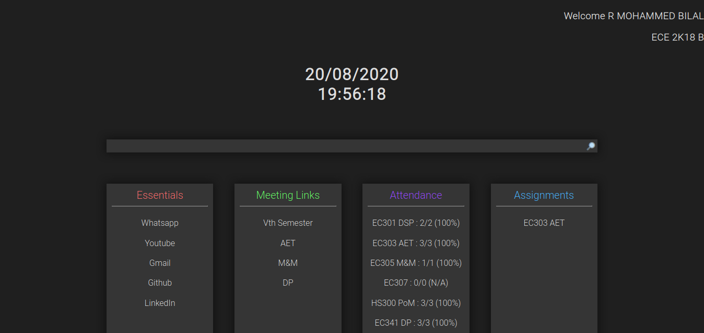

# PeverPage :rocket:

A custom homepage made for removing the burden of logging into your etlab dashboard.This homepage list your google meet links and your attendance for each subjects.Make this as your hompage on your so taht you don't need to log in each time beacause session timeouts.Now you grab your online class links right from your browser homepage.

## Usage

- Point your browser homepage to the URL ```https://peverpage.herokuapp.com/<admissionnumber>-<password>``` in your browser settings
- If you havent changed your passwd the ```https://peverpage.herokuapp.com/<admissionnumber>``` would be enough<br>
 

## Note
- Planning to add more lists as the classes progress.
- :star: this repo if you hate these online classes :zap:
